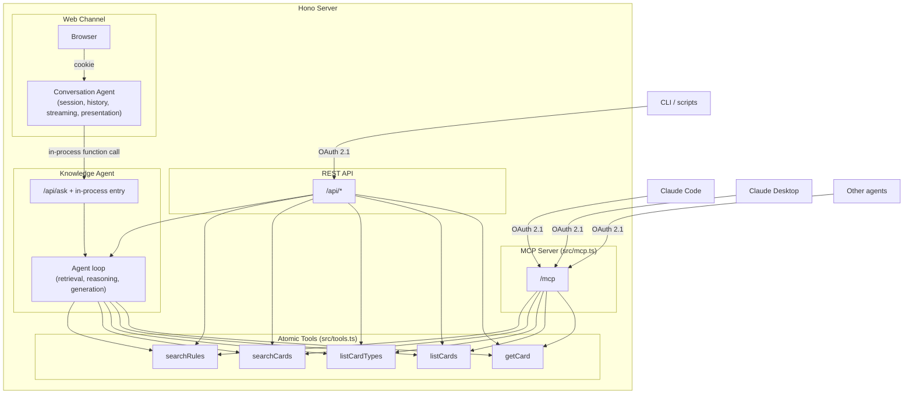
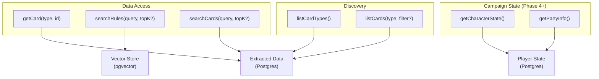

# Squire Architecture

**Version:** 1.0
**Date:** 2026-04-07
**Last Refreshed:** 2026-04-07
**Owner:** Architect
**Companion doc:** [SPEC.md](SPEC.md) — product / PM concerns (what / why / who / when)

This document is the architect-owned source of truth for **how** Squire is built — stack, data layer, agent model, tools, server topology, auth, observability, deployment, cost, code structure, and tech risks. Product direction, user-facing features, phases, and success metrics live in [SPEC.md](SPEC.md).

If you're updating Squire's strategy or what it's for, edit SPEC.md. If you're updating how it's built, edit this file. If a single change touches both — start in SPEC.md and propagate the technical implications here.

---

## Overview

Squire is a Frosthaven / Gloomhaven 2.0 knowledge agent. Its rules-Q&A core is built today; the multi-user platform, campaign state, recommendation engine, character-state ingestion, polish, and additional channels land in later phases (see [SPEC.md](SPEC.md) Development Phases).

The system is organized as a single Hono server that hosts:

- A **web UI channel** (server-rendered HTML for the human at the table)
- A **knowledge agent** (the agent loop that answers questions)
- A **conversation agent** (a thin session manager for the web UI that wraps the knowledge agent)
- A set of **atomic tools** (`searchRules`, `searchCards`, `listCardTypes`, `listCards`, `getCard`) over a generalized GHS-backed data layer
- An **MCP server** (`/mcp`) exposing the same atomic tools to external agent harnesses
- A **REST API** (`/api/*`) for non-MCP programmatic clients

All channels (web UI, MCP, REST, future Discord / iMessage) talk to the same knowledge agent and the same atomic tools.

---

## Architectural Principles

### Agent-native, not feature-driven

Following [agent-native architecture principles][agent-native]: features are outcomes described in prompts, pursued by agents with tools in iterative loops. Squire provides the knowledge tools; agents provide the reasoning. We do not build "card recommendation engine" or "rules lookup pipeline" as separate features — we build atomic data primitives, and the agent composes them with judgment.

[agent-native]: https://every.to/guides/agent-native

### Atomic tools, not bundled pipelines

The earliest version of Squire bundled embedding, vector search, card search, context assembly, and LLM generation into one `askFrosthaven()` function. This is the anti-pattern of "agent executes your workflow." The current architecture exposes atomic data access primitives that agents compose:

- `searchRules`, `searchCards` for content retrieval
- `listCardTypes`, `listCards`, `getCard` for discovery and exact lookup

The bundled `/api/ask` path doesn't disappear — it becomes an **optimized convenience path** for simple Q&A. Atomic tools are the foundation; the pipeline is a shortcut for the common case (graduated optimization).

### Generalization principle

Per-feature operations are *invocations*, not new tools. "Show me all level-4 character abilities for Drifter" is `listCards('character-abilities', { class: 'drifter', level: 4 })` — not a dedicated `queryCards()` tool. The same handful of tools handle every GHS card type via parameter, instead of one tool per feature. This keeps the tool surface tiny and the agent's decision space simple.

### Two-agent split: conversation agent + knowledge agent

Squire's web channel separates **conversation** from **knowledge**:

- **Conversation agent** — thin session manager. Owns chat history, context compaction (summarizing older messages to keep the window bounded), streaming via Server-Sent Events, and presentation (Hono JSX rendering, citations, tool call visibility). One per client session.
- **Knowledge agent** — the actual agent loop. Owns retrieval strategy (which atomic tools to call, in what order), reference resolution (turning "what items work with it?" into "Blinkblade items" via conversation history), campaign context loading (per Phase 4+), and answer generation. Stateless per request. Shared by all clients.

The conversation agent does **not** call atomic tools directly. It delegates all domain reasoning to the knowledge agent via in-process function calls (or `/api/ask` HTTP calls when used for testing or by other channels). This keeps the conversation agent focused on session and UX concerns, and lets the knowledge agent's retrieval strategy evolve independently of the UI.

**Note on transports:** an earlier design considered using **internal MCP** as the transport between the conversation and knowledge agents. That was dropped because internal callers would have needed to bypass auth, which was undesirable. The two-agent *split* remains; only the internal MCP *transport* was rejected. The split uses direct in-process function calls today.

This pays off as channels multiply (Phase 8). A future Discord bot or iMessage client can call the same knowledge agent with the same reasoning, instead of each channel reimplementing the agent loop. The knowledge agent becomes the durable core; conversation agents are channel-specific skins.

### Graduated optimization

The bundled `/api/ask` pipeline (search rules + search cards + one LLM call) exists today as a fixed path. Over time it evolves into a real agent loop that uses the atomic tools with judgment. The atomic tools are the foundation; the pipeline is an optimized shortcut for the common case that gets smarter incrementally.

### Dynamic capability discovery

Agents shouldn't need hard-coded knowledge of what data Squire has. They discover it at runtime via `listCardTypes()` and `listCards()`. New card types added to the GHS imports → agents discover and use them automatically. This is why `listCardTypes` exists as a first-class atomic tool, not just a developer convenience.

---

## Stack

**Language:** TypeScript end-to-end. Node 24, ESM modules.

### Web channel (frontend + server)

- **Server framework:** Hono (`@hono/node-server`)
- **UI rendering:** Hono JSX (server-rendered) + HTMX for interactivity + Tailwind CSS via CDN
- **Build pipeline:** none — no bundler, no client-side build step

*Rationale: chosen to keep the stack simple and lightweight — single language end-to-end, no bundler, no client build pipeline. Secondary goal: learn new application tech (already deeply familiar with React SPAs).*

### Database

- **Primary DB:** PostgreSQL (planned — currently flat JSON files in `data/extracted/` and `data/index.json`)
- **Vector DB:** pgvector extension on the same Postgres instance
- **ORM:** Drizzle, with `drizzle-kit` for migrations

*Rationale for Drizzle: first-class pgvector support (Prisma's is preview-only and forces raw SQL fallbacks), TypeScript-native schema (no DSL, no codegen step — fits the no-build-step theme), lightweight runtime, generates readable SQL.*

### Embeddings

- **Current:** `@xenova/transformers` running in-process. Model `Xenova/all-MiniLM-L6-v2` (384 dimensions, mean-pooled, normalized). See `src/embedder.ts`.

  *Rationale: chosen for simplicity getting started — no API key, no network roundtrip during indexing, no per-token cost.*

- **Upgrade path:** if retrieval quality doesn't hold up at production scale, swap to **Voyage AI** (purpose-built for retrieval, strong benchmark performance, integrates cleanly with Anthropic-based stacks). The vector store (pgvector) is independent and doesn't change.

*Note: embedding model and vector store are two independent choices that can evolve separately.*

### LLM

- **Provider:** Anthropic Claude API (`@anthropic-ai/sdk`)
- **Current model:** Claude Sonnet 4.6 (`claude-sonnet-4-6`) — single-model setup. See `src/agent.ts:155`.
- **Future tiering** (when justified by cost or quality):
  - Sonnet 4.6 — default agent loop
  - Haiku 4.5 — cheap / fast cases (simple lookups, classification)
  - Opus 4.6 — complex reasoning only when Sonnet falls short
- **Capabilities used:** long context, tool use, structured JSON output. Vision is reserved for the future character-state ingestion path (Phase 6 in SPEC.md) and is not part of the current architecture.

### Document parsing

- **Rulebook ingestion:** `pdf-parse` for the Frosthaven and (forthcoming) Gloomhaven 2.0 rulebook PDFs in `data/pdfs/`, chunked and embedded into pgvector via `src/index-docs.ts`.

### Authentication

- **Approach:** custom Hono middleware. Google OAuth as the only identity provider for the web channel (extends the existing OAuth 2.1 infrastructure already built for the MCP layer). Server-side sessions stored in Postgres. HttpOnly + Secure + SameSite=Strict cookies. CSRF tokens for mutating endpoints.

*Rationale: avoid SaaS vendor dependency in the auth path, no per-MAU pricing, reuses code that already exists for MCP. Single IdP for the web channel keeps the surface area tiny.*

External MCP / REST clients use OAuth 2.1 via the existing `@modelcontextprotocol/sdk` auth handlers (auth code + PKCE for interactive, client credentials for machine-to-machine, dynamic client registration supported).

### Edge layer

- **Cloudflare** in front of the hosted app as a WAF. Provides DDoS protection, edge rate limiting, and bot mitigation. Application-level rate limiting on expensive endpoints (`/api/ask`, `/mcp`) still lives in-app for per-user cost budgets.

### Observability infrastructure

- `@opentelemetry/sdk-node` for OTel traces from the agent loop, tool calls, and HTTP handlers (initialized in `src/instrumentation.ts`)
- `@langfuse/client`, `@langfuse/otel`, `@langfuse/tracing` for LLM trace export and eval pipeline

See [Observability](#observability) below.

---

## Game Dimension

Squire targets multiple games in the *haven family. Today: Frosthaven. Phase 2: Gloomhaven 2.0. Future: possibly Jaws of the Lion, the original Gloomhaven, or others.

To prevent cross-contamination between games (e.g., the agent answering a GH2 question with a Frosthaven rule), each piece of game data carries a `game` dimension:

- **Card records** carry an explicit `game` field: `'frosthaven' | 'gloomhaven-2'` (extensible)
- **Rule chunks** are implicitly tagged via filename prefix in `data/pdfs/`: `fh-rule-book.pdf`, `gh2-rule-book.pdf`, etc. The `source` field in the vector store carries the basename.
- **Atomic tools** accept an optional `game` filter parameter (e.g., `listCards('items', { game: 'gloomhaven-2', prosperity: 4 })`)
- **Agent system prompt** is told which game the user is asking about. Phase 2 uses a per-session game selector. Phase 4+ infers game from the user's active campaign.

The `game` field on import records is added in Phase 2 alongside the GH2 import scripts. Existing FH records get `game: 'frosthaven'` retroactively when the schema lands.

---

## Data Architecture

### Static Game Data — Gloomhaven Secretariat (GHS)

Squire imports static game data directly from **Gloomhaven Secretariat (GHS)** — an open-source Gloomhaven / Frosthaven companion app maintained by Lurkars on GitHub: <https://github.com/Lurkars/gloomhavensecretariat>. GHS maintains structured data in its `data/` subfolder, community-maintained and auto-formatted on commit. GHS already supports Gloomhaven 2nd Edition, which unblocks Phase 2.

Squire has dedicated import scripts in `src/import-*.ts` for each card type:

- `import-battle-goals.ts`
- `import-buildings.ts`
- `import-character-abilities.ts`
- `import-character-mats.ts`
- `import-events.ts`
- `import-items.ts`
- `import-monster-abilities.ts`
- `import-monster-stats.ts`
- `import-personal-quests.ts`
- `import-scenarios.ts`

Output goes to `data/extracted/*.json` (current dev) and to Postgres tables (after the storage migration).

GHS is comprehensive enough for Phase 1 (rules Q&A) and most of the long-term recommendation engine. If gaps emerge later, the plan is:

1. First, contribute upstream to GHS to fill the gap
2. Failing that, spin up an OCR pipeline as a last resort

*Historical note: an earlier version of Squire used the worldhaven repository plus an OCR pipeline. Both were retired (commit `34a26a1`) once GHS proved sufficient.*

### Rules Database

- Extract text from rulebook PDFs in `data/pdfs/` using `pdf-parse`
- Chunk into semantic sections in `src/index-docs.ts`
- Generate embeddings via the local Xenova model (see [Stack → Embeddings](#embeddings))
- Store in pgvector after the storage migration; today in flat-file `data/index.json`
- RAG retrieval via `searchRules()` (see [Atomic Tools](#atomic-tools))

### Storage strategy

| Data | Dev (current) | Production |
| --- | --- | --- |
| User / campaign / player state | N/A (Phase 4) | Postgres |
| Vector embeddings | `data/index.json` (flat) | Postgres + pgvector |
| Extracted card data | `data/extracted/*.json` | Postgres tables |
| OAuth tokens / clients | N/A (Phase 1) | Postgres |
| Conversation history | In-memory per session | Postgres |

pgvector handles vector similarity search in the same database — no separate vector service at this scale. Source PDFs (~34GB+) are inputs to indexing, not deployed artifacts; they live in `data/pdfs/` for local development and are excluded from the production image.

### Character State

*Phase 4 (manual entry) and Phase 6 (automated ingestion). See [SPEC.md](SPEC.md) for the user-facing description and the five ingestion options under consideration. The data model is:*

```typescript
{
  characterId: string
  userId: string
  campaignId: string
  game: 'frosthaven' | 'gloomhaven-2'
  className: string
  level: number
  xp: number
  gold: number
  ownedCards: string[]
  activeCards: string[]
  items: string[]
  prosperity: number
  campaignProgress: {
    unlockedClasses: string[]
    completedScenarios: string[]
    // etc.
  }
  lastSyncedAt: timestamp
  syncMethod: 'manual' | 'browser-extension' | 'json-export' | 'sync-protocol' | 'screenshot-vision' | 'ghs-tracker'
}
```

### Build Guides

*Phase 5 (with the recommendation engine). See [SPEC.md](SPEC.md). Curated URL list, agent fetches on-demand via `fetchBuildGuide(url)`, no parsing — Claude reads guides in their native format.*

### User Conversations

- Stored in Postgres (after Phase 3 multi-user platform), scoped to user
- Bounded context window via summarization of older messages
- Used as context for future turns

---

## Agent Architecture

### Core agent loop

1. **Input:** User message (text)
2. **Context gathering:** Load conversation history (with bounded summarization), identify caller identity from session, load campaign context if available
3. **Tool use:** Claude calls atomic tools to retrieve relevant rules, cards, items, monsters, or scenarios
4. **Reasoning:** Claude synthesizes a response from tool results
5. **Response:** Stream back to the channel (web UI via SSE, MCP via protocol response)
6. **Memory:** Persist conversation turn for future context

### Two-agent model



The conversation agent **never calls atomic tools directly** — it always goes through the knowledge agent. External MCP and REST clients can call atomic tools directly (they bring their own reasoning) or hit the knowledge agent via `/api/ask` (they want Squire's reasoning).

### Atomic tools

Squire exposes a **generalized atomic-tools API** in `src/tools.ts` that works across all GHS card types — monsters, items, events, buildings, scenarios, character abilities, character mats, battle goals, personal quests. The same handful of tools handle every card type via parameter, rather than one tool per feature.

| Tool | Purpose |
| --- | --- |
| `searchRules(query, topK)` | Vector search over the rulebook RAG index |
| `searchCards(query, topK)` | Keyword search across all card types |
| `listCardTypes()` | Discovery — returns all GHS data types with record counts |
| `listCards(type, filter)` | List records of a given type with field-level AND filter (including `game` once Phase 2 lands) |
| `getCard(type, id)` | Exact lookup by natural ID (name, number, cardId, etc.) |



**Future tools** (added as later phases land):

- `getCharacterState(characterId)` — Phase 4, campaign state
- `getPartyInfo(campaignId)` — Phase 4, campaign state
- `fetchBuildGuide(url)` — Phase 5, recommendation engine
- `extractCharacterFromScreenshots(images[])` — Phase 6, only if screenshot path is chosen over browser-extension or GHS-as-tracker alternatives

### Why atomic tools matter

With a bundled `askFrosthaven()` alone, an agent can only ask a question and get an answer. With atomic tools, an agent can compose:

- "Compare the stats of all flying monsters at level 3"
- "Find all items that grant advantage, cross-reference with Blinkblade abilities"
- "What scenarios chain from scenario 61, and what monsters appear in them?"
- "We're fighting Earth Demons tonight — what are they immune to, and which of our items counter that?"

These are **emergent capabilities** — Squire never built features for them, but agents compose the tools to accomplish them.

### The `/api/ask` endpoint (knowledge agent entry)

`POST /api/ask` is the knowledge agent's HTTP entry point. It receives:

```json
{
  "question": "What items should I bring to tonight's scenario?",
  "history": [
    { "role": "user", "content": "We're playing scenario 14 tonight" },
    { "role": "assistant", "content": "Scenario 14 is..." }
  ],
  "campaignId": "frosthaven-2024",
  "userId": "bcm",
  "game": "frosthaven"
}
```

`campaignId`, `userId`, and `game` are optional. Without them the knowledge agent answers general rules questions using only the rulebook and card data. With them it personalizes — "what items should I bring?" depends on which character *you* are playing in *this campaign* of *which game*.

The knowledge agent:

1. **Resolves references** — "it" in "what items work well with it?" becomes "Blinkblade" using conversation history
2. **Decides retrieval strategy** — which atomic tools to call, in what order, how many results to fetch
3. **Loads context** (if campaign / user provided) — shared campaign state plus the player's character, items, and personal quest
4. **Generates a grounded answer** — from source material, personalized to this player's situation when campaign context is available

Today this is a fixed pipeline (search rules + search cards + one LLM call). It evolves into a real agent loop using atomic tools with judgment over time (graduated optimization).

The conversation agent calls this entry point via in-process function call, not HTTP. The HTTP endpoint exists for testing and for other channels (CLI, scripts, future Discord bot).

---

## MCP Server

Squire exposes its atomic knowledge tools via the **Model Context Protocol** over a `/mcp` endpoint (`src/mcp.ts`). Streamable HTTP transport, OAuth 2.1 in production. This makes Squire's *haven knowledge accessible to any MCP-capable agent harness — Claude Code, Claude Desktop, or other AI tools — without going through Squire's own conversation UI.

### Use cases

- Brian uses Claude Code with Squire's MCP tools mounted to ask rules questions during development
- Future end users may opt to mount Squire as an MCP server in their own agent of choice (treated like a public API surface, with auth)
- Other AI tools in the *haven ecosystem could compose Squire's knowledge tools into larger workflows

### Channel framing

MCP-capable agents are a **third channel type** alongside the web UI (primary today) and future Discord / iMessage clients. All channels talk to the same underlying knowledge agent and the same atomic tools.

### Auth on `/mcp`

The OAuth 2.1 infrastructure protects the MCP endpoint. No anonymous access in production. The web channel's Google-OAuth login extends this same infrastructure rather than running a parallel auth system. OAuth endpoints are built into the Hono server using `@modelcontextprotocol/sdk` auth handlers:

- `/.well-known/oauth-authorization-server` — metadata discovery
- `/.well-known/oauth-protected-resource` — resource metadata
- `/authorize` — consent page
- `/token` — token issuance
- `/register` — dynamic client registration

PKCE required for all interactive clients. Dynamic Client Registration supported so clients auto-register without manual setup.

### Internal MCP rejected

An earlier design considered using **internal MCP** as the transport between the conversation agent and the knowledge agent. That was rejected because internal callers would have needed to bypass auth, which was undesirable. The two-agent split remains; only the internal MCP transport was dropped. The conversation agent calls the knowledge agent via direct in-process function calls today.

---

## Client Types

| Client | Interface | Auth | Identity propagation |
| --- | --- | --- | --- |
| Web UI | `/api/ask` (in-process) | Google OAuth session cookie | userId + campaignId from session |
| Claude Desktop | `/mcp` | OAuth 2.1 (auth code + PKCE) | userId from token |
| Claude Code | `/mcp` | OAuth 2.1 (auth code + PKCE) | userId from token |
| Other MCP agents | `/mcp` | OAuth 2.1 | userId from token |
| CLI / scripts | `/api/*` | OAuth 2.1 | userId from token or service identity |
| Discord (Phase 8) | `/api/ask` | Service credentials | userId from Discord identity mapping |
| iMessage (Phase 8) | `/api/ask` | TBD | TBD |

**Web UI conversation agent:**

- Calls the knowledge agent's in-process entry point with question, conversation history, campaign ID
- Does **not** call MCP tools directly — delegates domain reasoning to the knowledge agent
- Owns session management: chat history, context compaction, streaming, presentation

**External MCP clients:**

- Use Streamable HTTP transport over the network
- Access atomic tools directly — they bring their own reasoning
- OAuth 2.1 required (auth code + PKCE for interactive, client credentials for machine-to-machine)

**REST clients:**

- Use REST endpoints for search, card lookup, and `/api/ask`
- OAuth 2.1 required

---

## Observability

Squire emits OpenTelemetry traces from the agent loop, tool calls, and HTTP handlers via `@opentelemetry/sdk-node`. Initialization lives in `src/instrumentation.ts`.

**LLM observability and evals: Langfuse.** Trace exports flow into Langfuse via `@langfuse/otel` and `@langfuse/tracing`. Each conversation, tool call, and model call is captured as a structured trace. Langfuse's built-in LLM-as-judge eval templates grade production traces (planned). Langfuse was chosen specifically for its eval system, which is more capable than alternatives for LLM-as-judge workflows.

**APM and RUM: open.** General application metrics (request latency, error rates, DB query performance) and real-user monitoring on the web channel are not yet wired up. **Datadog** is a candidate one-stop shop for both, but a previous evaluation found that Datadog's LLM observability API has limitations that make Langfuse a better fit for evals — so even if Datadog is adopted for APM / RUM, Langfuse stays for LLM-specific observability. See [Open Tech Questions](#open-tech-questions).

---

## Deployment

**Hosting (open, decision deferred — see [Open Tech Questions](#open-tech-questions)):**

- **Fly.io** — VM-based, global regions, good Postgres story (Fly Postgres), Docker-native
- **Railway** — simple deploys from a Dockerfile, included Postgres add-on, $5/mo hobby tier
- **Render** — managed services + Postgres, similar to Railway, free tier for hobby
- **Self-hosted VPS** (Hetzner, DigitalOcean) — most control, most ops work

All four work with the Docker-first deployment plan. Cloudflare WAF sits in front regardless of host choice.

**CI/CD:**

- Build and test on push
- Deploy to staging on `main` merge
- Deploy to production on release tag
- Run database migrations as part of deploy
- Smoke test after deploy (hit `/api/health`)
- Rollback capability

---

## Cost

**Estimated monthly cost (Phase 1 MVP):**

- Hosting: $0–10 (free tiers on Fly / Railway / Render, or hobby plan)
- Postgres: $0–10 (included in host's free tier or hobby add-on)
- Cloudflare WAF: $0 (free tier)
- Claude API (Sonnet 4.6): ~$10–30 depending on chat volume
- **Total: ~$10–50/month** for a single user with moderate usage

Costs grow when Phase 3 (multi-user) and Phase 5 (recommendation engine) ship. Per-user daily budget circuit breakers, embedding caching, and model tiering (Haiku for cheap cases) are the primary mitigations. Vision API costs (~$0.15–0.30 per character sync) are deferred to Phase 6 and only apply if the screenshot path is chosen over the browser-extension or GHS-as-tracker alternatives.

---

## Code Structure

```text
src/
  agent.ts                      Conversation + knowledge agent loop, model invocation
  auth.ts                       Auth middleware (OAuth 2.1 + Google OAuth web)
  embedder.ts                   Local embeddings via Xenova all-MiniLM-L6-v2
  extracted-data.ts             Card data loading, search, formatting
  ghs-utils.ts                  Shared helpers for GHS imports
  index-docs.ts                 PDF → chunks → embeddings → vector store (npm run index)
  instrumentation.ts            OpenTelemetry + Langfuse setup
  mcp.ts                        MCP tool registration (Streamable HTTP transport)
  query.ts                      CLI wrapper over the knowledge agent
  schemas.ts                    Zod schemas for all GHS card types
  server.ts                     Hono server (REST + MCP transport + web UI host)
  service.ts                    Service initialization, readiness, graduated /api/ask path
  tools.ts                      Atomic tools: searchRules, searchCards, listCardTypes, listCards, getCard
  vector-store.ts               Vector index storage and cosine similarity search
  types/                        Shared TypeScript types
  import-battle-goals.ts        GHS importer
  import-buildings.ts           GHS importer
  import-character-abilities.ts GHS importer
  import-character-mats.ts      GHS importer
  import-events.ts              GHS importer
  import-items.ts               GHS importer
  import-monster-abilities.ts   GHS importer
  import-monster-stats.ts       GHS importer
  import-personal-quests.ts     GHS importer
  import-scenarios.ts           GHS importer

data/
  pdfs/                         Source rulebook + scenario / section PDFs (input to indexing)
  extracted/*.json              Card data (current dev — migrates to Postgres)
  index.json                    Vector index (current dev — migrates to pgvector)
```

For developer setup, running the server, working on import scripts locally, and testing, see [DEVELOPMENT.md](DEVELOPMENT.md).

---

## Tech Risks

1. **Embedding quality.** The local Xenova model is chosen for simplicity, not for retrieval quality. If RAG accuracy isn't good enough at production scale, the planned upgrade is Voyage AI. The vector store (pgvector) doesn't change. Mitigation: monitor retrieval quality via Langfuse evals; swap embeddings if scores drop.

2. **Browser-extension fragility (Phase 6).** The browser-extension and JSON-export approaches for character state ingestion inherit the same class of risk as classic web scraping — site DOM / localStorage shape can change without notice and break extraction silently. localStorage schema is undocumented and not a stable contract. No SLA from the storyline maintainers. Mitigation: keep manual entry as a permanent fallback; pin the extension to a known schema version with a clear "site updated, extension needs work" error.

3. **Build guide web fetch reliability (Phase 5).** Google Docs and Reddit posts can be slow to fetch (2–5s) or rate-limited. Link rot: guides get deleted, moved, made private. Mitigation: cache fetched guides server-side, maintain archived copies of curated guides, implement RAG fallback if web fetch proves unreliable.

4. **Build guide content nuance (Phase 5).** Even with on-demand fetch (no parsing), Claude has to interpret guide content with conditional logic, alternatives, and opinion. Pure recommendations are rare. The agent needs to surface this nuance, not flatten it into a single answer.

5. **Claude API costs at scale.** Phase 1 cost is small. Once multi-user (Phase 3+) and the recommendation engine (Phase 5) ship, per-user cost increases. Mitigation: per-user daily budget circuit breakers, cache aggressively, monitor via Langfuse, model tiering (Haiku for cheap cases) when justified.

6. **frosthaven-storyline.com may not support Gloomhaven 2.0 (Phase 2 / Phase 6).** Brian uses storyline as his canonical campaign tracker for Frosthaven today. If storyline doesn't support GH2 by transition time, all four storyline-based ingestion options in Phase 6 become non-viable for GH2. Mitigation: option 5 in Phase 6 (GHS-as-tracker) sidesteps this entirely. Action: confirm storyline GH2 support before Phase 2 begins.

7. **Prompt injection.** The knowledge agent assembles context from multiple sources (rulebook, card data, conversation history, campaign state) and sends it to Claude. Every input path is a prompt injection surface. See [SECURITY.md](SECURITY.md) for the full threat model and mitigations.

8. **OAuth implementation surface.** Custom auth is a real trust boundary. Use MCP SDK auth handlers, exact-match redirect URI validation, rate limit client registration, short-lived tokens with refresh rotation, encrypt at rest. See [SECURITY.md](SECURITY.md).

9. **Campaign data isolation (Phase 4).** Multiplayer campaigns require strict horizontal privilege separation — User A must not see User B's personal quest or battle goals, even via LLM-mediated leaks. The data isolation design must come **before** building the campaign data model, not after. See [SECURITY.md](SECURITY.md).

---

## Open Tech Questions

- **APM / RUM stack.** Datadog as a one-stop shop for application metrics and real-user monitoring (with Langfuse staying for LLM-specific observability), or stay Langfuse-only and skip APM until volume demands it?
- **Hosting platform.** Fly.io vs Railway vs Render vs self-hosted VPS — defer until Phase 1 deployment work begins.
- **Character state ingestion path (Phase 6).** Browser extension vs JSON export vs storyline sync protocol vs screenshot+Vision vs GHS-as-tracker — defer until Phase 6 begins. The GH2 campaign may force this decision earlier than the Frosthaven one.
- **Storyline GH2 support (Phase 2 prerequisite).** Confirm whether frosthaven-storyline.com supports Gloomhaven 2.0. If not, Brian's GH2 campaign-tracking workflow needs to switch (most likely to GHS).

---

## Changelog

- **2026-04-07 (v1.0):** Born from the v3.0 split of `frosthaven-agent-product-spec.md`. Absorbed all Technical Architecture content (Stack, Data Architecture, Agent Architecture, MCP Server, Observability, Deployment, Cost), tech risks, and tech open questions from the old single-file spec. Absorbed the architectural principles, two-agent split rationale, atomic tools rationale, code structure, and Mermaid diagrams from the old `docs/architecture-plan.md` (which is now deleted). Fixed the v2.1 misstatement about the two-agent split: only the internal MCP *transport* was dropped, not the split itself. Added the `game` dimension section for Frosthaven + Gloomhaven 2.0 support. Updated all code references (`src/*.ts`) including the 10 import scripts. The old `docs/architecture-plan.md` content is preserved in git history before this commit.
