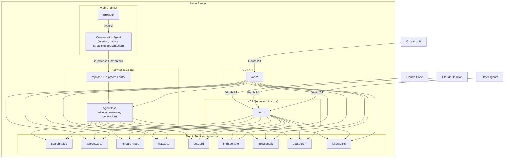
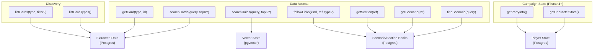

# Squire Architecture

**Version:** 1.0.8
**Date:** 2026-04-07
**Last Refreshed:** 2026-04-21
**Owner:** Architect
**Companion doc:** [SPEC.md](SPEC.md) — product / PM concerns (what / why / who / when)

This document is the architect-owned source of truth for **how** Squire is built — stack, data layer, agent model, tools, server topology, auth, observability, deployment, cost, code structure, and tech risks. Product direction, user-facing features, phases, and success metrics live in [SPEC.md](SPEC.md).

If you're updating Squire's strategy or what it's for, edit SPEC.md. If you're updating how it's built, edit this file. If a single change touches both — start in SPEC.md and propagate the technical implications here.

## What belongs in this file (and what doesn't)

ARCHITECTURE.md is the system shape, not the implementation. Before adding anything, check:

- **Belongs:** the boundaries, roles, and contracts. Layering rules. Auth boundaries. Data model decisions. The "why we picked this" for the choices that would otherwise need an ADR. User-visible behavior with real product impact (the LLM-history cap of 20 messages is a good example — it shapes what the agent can remember).
- **Does not belong:** function names, constant names, file paths, or class names — that's grep territory. Tunable performance knobs that have no current user impact. Render-time defensive techniques that exist to harden against rare edge cases. Anything you'd describe as "an implementation detail" — that belongs in a code comment at the call site, not here.
- **Tone test:** if a sentence reads like documentation for the implementer ("we pair Q+A by `responseToMessageId` before mapping to articles"), it's a code comment. If it reads like documentation for the system reader ("the conversation page is a scrolling transcript"), it's architecture.
- **The drift signal:** if you're tempted to name a constant or file path here so a future agent can find it, write the code comment instead and link the file. Architecture documents do not age well as grep indexes.

---

## Overview

Squire is a Frosthaven / Gloomhaven 2.0 knowledge agent. Its rules-Q&A core is built today; the multi-user platform, campaign state, recommendation engine, character-state ingestion, polish, and additional channels land in later phases (see [SPEC.md](SPEC.md) Development Phases).

The system is organized as a single Hono server that hosts:

- A **web UI channel** (server-rendered HTML for the human at the table)
- A **knowledge agent** (the agent loop that answers questions)
- A **conversation agent** (a thin session manager for the web UI that wraps the knowledge agent)
- A set of **atomic tools** over three retrieval surfaces: semantic book search (`searchRules`), exact scenario/section-book research (`findScenario`, `getScenario`, `getSection`, `followLinks`), and generalized GHS card lookup (`searchCards`, `listCardTypes`, `listCards`, `getCard`)
- An **MCP server** (`/mcp`) exposing the same atomic tools to external agent harnesses
- A **REST API** (`/api/*`) for non-MCP programmatic clients

All channels (web UI, MCP, REST, future Discord / iMessage) talk to the same knowledge agent and the same atomic tools.

---

## Architectural Principles

### Agent-native, not feature-driven

Following [agent-native architecture principles][agent-native]: features are outcomes described in prompts, pursued by agents with tools in iterative loops. Squire provides the knowledge tools; agents provide the reasoning. We do not build "card recommendation engine" or "rules lookup pipeline" as separate features — we build atomic data primitives, and the agent composes them with judgment.

[agent-native]: https://every.to/guides/agent-native

### Atomic tools, not bundled pipelines

The earliest version of Squire bundled embedding, vector search, card search, context assembly, and LLM generation into one `askFrosthaven()` function. This is the anti-pattern of "agent executes your workflow." The current architecture exposes atomic data access primitives that agents compose:

- `searchRules` for semantic book-corpus retrieval
- `findScenario`, `getScenario`, `getSection`, `followLinks` for deterministic scenario/section-book traversal
- `searchCards`, `listCardTypes`, `listCards`, `getCard` for GHS card discovery and exact lookup

The bundled `/api/ask` path doesn't disappear — it becomes an **optimized convenience path** for simple Q&A. Atomic tools are the foundation; the pipeline is a shortcut for the common case (graduated optimization).

### Generalization principle

Per-feature operations are _invocations_, not new tools. "Show me all level-4 character abilities for Drifter" is `listCards('character-abilities', { class: 'drifter', level: 4 })` — not a dedicated `queryCards()` tool. The same handful of tools handle every GHS card type via parameter, instead of one tool per feature. This keeps the tool surface tiny and the agent's decision space simple.

### Two-agent split: conversation agent + knowledge agent

Squire's web channel separates **conversation** from **knowledge**:

- **Conversation agent** — thin session manager. Owns persisted chat history,
  failure persistence, ownership checks, streaming via Server-Sent Events, and
  presentation (Hono JSX rendering, citations, tool call visibility). In the
  web UI, live deltas stay plain text until the stream completes; the terminal
  `done` event swaps in one sanitized server-rendered HTML fragment. Real
  context compaction and summarization remain future work (SQR-12). One per
  client session.
- **Knowledge agent** — the actual agent loop. Owns retrieval strategy (which atomic tools to call, in what order), reference resolution (turning "what items work with it?" into "Blinkblade items" via conversation history), campaign context loading (per Phase 4+), and answer generation. Stateless per request. Shared by all clients.

The conversation agent does **not** call atomic tools directly. It delegates all domain reasoning to the knowledge agent via in-process function calls (or `/api/ask` HTTP calls when used for testing or by other channels). This keeps the conversation agent focused on session and UX concerns, and lets the knowledge agent's retrieval strategy evolve independently of the UI.

The browser-visible SSE event vocabulary and ordering guarantees live in
[SSE_CONTRACT.md](SSE_CONTRACT.md). Treat that as the contract source of truth
when changing stream routes, browser rendering, or regression coverage.

**Note on transports:** an earlier design considered using **internal MCP** as the transport between the conversation and knowledge agents. That was dropped because internal callers would have needed to bypass auth, which was undesirable. The two-agent _split_ remains; only the internal MCP _transport_ was rejected. The split uses direct in-process function calls today.

This pays off as channels multiply (Phase 8). A future Discord bot or iMessage client can call the same knowledge agent with the same reasoning, instead of each channel reimplementing the agent loop. The knowledge agent becomes the durable core; conversation agents are channel-specific skins.

### Graduated optimization

The bundled `/api/ask` pipeline (search rules + search cards + one LLM call) exists today as a fixed path. Over time it evolves into a real agent loop that uses the atomic tools with judgment. The atomic tools are the foundation; the pipeline is an optimized shortcut for the common case that gets smarter incrementally.

### Dynamic capability discovery

Agents shouldn't need hard-coded knowledge of what data Squire has. They discover it at runtime via `listCardTypes()` and `listCards()`. New card types added to the GHS imports → agents discover and use them automatically. This is why `listCardTypes` exists as a first-class atomic tool, not just a developer convenience.

---

## Stack

**Language:** TypeScript end-to-end. Node 24, ESM modules.

### Web channel (frontend + server)

- **Server framework:** Hono (`@hono/node-server`)
- **UI rendering:** Hono JSX (server-rendered) + HTMX for interactivity + Tailwind CSS compiled in-process via `@tailwindcss/node`
- **Assistant rendering boundary:** `markdown-it` on the server, with raw HTML
  disabled, non-HTTPS links rejected, and one shared renderer reused for both
  persisted transcript pages and final post-stream answer fragments
- **Build pipeline:** no JavaScript bundler and no client-side build step. `GET /app.css` compiles `src/web-ui/styles.css` in-process via `@tailwindcss/node` on first request and caches the result in a module-level variable; dev keys the cache on source-file mtime so edits show up on the next request, prod compiles exactly once per process. Prod serves the compiled CSS at a content-hashed URL (`/app.<hash>.css`) with `Cache-Control: public, max-age=31536000, immutable` so Cloudflare and browsers can cache forever and invalidation is automatic on content change; dev serves the bare `/app.css` path with `Cache-Control: no-cache`. A parallel `/squire.js` handler serves vanilla-JS islands (currently the SQR-66 cite tap-toggle) with the same caching pattern. No `public/` build output, no `npm run build:css` — every fresh clone renders correctly without a build prerequisite.

HTML responses also carry a shared Content Security Policy set in
`src/server.ts`. The policy is `self`-only except for the current Google Fonts
carve-out in `style-src` / `font-src`. JSON, SSE, and JS/CSS asset responses do
not get the HTML CSP header.

_Rationale: chosen to keep the stack simple and lightweight — single language end-to-end, no JS bundler, no client build pipeline. Secondary goal: learn new application tech (already deeply familiar with React SPAs)._

_Tailwind delivery decision: see [ADR 0011 — On-demand asset pipeline via in-process Tailwind JIT](adr/0011-on-demand-asset-pipeline.md) (supersedes [ADR 0008](adr/0008-tailwind-cli-for-production-css.md))._

_Chat surface layout decision: the conversation page (`/chat/:id`) renders a standard scrolling-chat transcript — every persisted turn stacked oldest-to-newest inside one `role="log" aria-live="polite"` `<section class="squire-transcript">`. Drop cap rarity is preserved by position (`:not(:has(~ .squire-answer))::first-letter` targets only the newest answer). The authenticated home page (`/`) is a separate purpose-built landing — Fraunces hero + scope line + input dock — not the empty state of a transcript. See [ADR 0012 — Split home + scrolling-chat IA](adr/0012-split-home-and-scrolling-chat-ia.md) (supersedes [ADR 0010](adr/0010-current-turn-ledger.md)) and the design system in [DESIGN.md](../DESIGN.md)._

### Database

- **Primary DB:** PostgreSQL. Indexed Frosthaven book embeddings live in the `embeddings` pgvector table (SQR-33). Extracted GHS card data lives in 10 `card_*` tables with per-table `search_vector` (tsvector) generated columns and GIN indexes for full-text search (SQR-56). The committed `data/extracted/*.json` files are now seed inputs to `src/seed/seed-cards.ts`, not the runtime store.
- **Vector DB:** pgvector extension on the same Postgres instance
- **ORM:** Drizzle, with `drizzle-kit` for migrations

_Rationale for Drizzle: first-class pgvector support (Prisma's is preview-only and forces raw SQL fallbacks), TypeScript-native schema (no DSL, no codegen step — fits the no-build-step theme), lightweight runtime, generates readable SQL._

### Embeddings

- **Current:** `@xenova/transformers` running in-process. Model `Xenova/all-MiniLM-L6-v2` (384 dimensions, mean-pooled, normalized). See `src/embedder.ts`.

  _Rationale: chosen for simplicity getting started — no API key, no network roundtrip during indexing, no per-token cost._

- **Upgrade path:** if retrieval quality doesn't hold up at production scale, swap to **Voyage AI** (purpose-built for retrieval, strong benchmark performance, integrates cleanly with Anthropic-based stacks). The vector store (pgvector) is independent and doesn't change.

_Note: embedding model and vector store are two independent choices that can evolve separately._

### LLM

- **Provider:** Anthropic Claude API (`@anthropic-ai/sdk`)
- **Current model:** Claude Sonnet 4.6 (`claude-sonnet-4-6`) — single-model setup. See `src/agent.ts:155`.
- **Future tiering** (when justified by cost or quality):
  - Sonnet 4.6 — default agent loop
  - Haiku 4.5 — cheap / fast cases (simple lookups, classification)
  - Opus 4.6 — complex reasoning only when Sonnet falls short
- **Capabilities used:** long context, tool use, structured JSON output. Vision is reserved for the future character-state ingestion path (Phase 6 in SPEC.md) and is not part of the current architecture.

### Document parsing

- **Book-corpus ingestion:** `pdf-parse` for the Frosthaven PDFs in `data/pdfs/` (rulebook, scenario books, section books, puzzle book), chunked and embedded into pgvector via `src/index-docs.ts`.

### Authentication

Two isolated auth systems, one per channel:

**Web channel: Google OAuth + Postgres sessions** (`src/auth/google.ts`, `src/auth/session-middleware.ts`, `src/auth/csrf.ts`). Squire acts as an OAuth **client**, redirecting users to Google for consent. The callback verifies the ID token via `google-auth-library`, checks a hard-coded email allowlist (Phase 1, ADR 0009), upserts the user, and creates a server-side session in the `sessions` table. Session cookie: HttpOnly, Secure (production only), SameSite=Lax, signed via `SESSION_SECRET`. `Lax` is required for the browser to carry the new session across the Google OAuth callback redirect back into the app. 30-day expiry matching the long-lived token DX policy. PKCE state and code_verifier are stored in a short-lived signed cookie during the OAuth flow. Mutating web routes use a per-session CSRF token derived from the session ID and `SESSION_SECRET`, rendered into authenticated HTML and attached to HTMX requests via inherited `hx-headers`.

**MCP/REST channel: OAuth 2.1 bearer tokens** (`src/auth/provider.ts`, `src/auth.ts`). Squire acts as an OAuth **server** via the `@modelcontextprotocol/sdk` auth handlers (auth code + PKCE for interactive, client credentials for machine-to-machine, dynamic client registration). MCP bearer tokens are long-lived per [ADR 0002](adr/0002-long-lived-oauth-bearer-tokens.md).

The two systems are deliberately isolated: different mechanisms (cookies vs bearer tokens), different threat models, different middleware (`requireSession()` vs `requireBearerAuth()`). Web routes (`/auth/*`, `/chat`) use session cookies. API/MCP routes (`/api/*`, `/mcp`) use bearer tokens. No crossover.

_Rationale: avoid SaaS vendor dependency in the auth path, no per-MAU pricing. Single IdP (Google) for the web channel keeps the surface area tiny. See [ADR 0009 — Google OAuth + hard-coded allowlist](adr/0009-google-oauth-with-hardcoded-allowlist.md)._

### Edge layer

- **Cloudflare** in front of the hosted app as a WAF. Provides DDoS protection, edge rate limiting, and bot mitigation. Application-level rate limiting on expensive endpoints (`/api/ask`, `/mcp`) still lives in-app for per-user cost budgets.

### Observability infrastructure

- `@opentelemetry/sdk-node` for OTel traces from the agent loop, tool calls, and HTTP handlers (initialized in `src/instrumentation.ts`)
- `@langfuse/client`, `@langfuse/otel`, `@langfuse/tracing` for LLM trace export and eval pipeline

See [Observability](#observability) below.

---

## Application Layering

Squire's server code is organized in four layers. Dependencies flow down only: a route handler can call middleware and repositories, but a repository never renders HTML and a view never queries the database. These boundaries are enforced by custom ESLint rules (see [docs/agent/lint-rules.md](agent/lint-rules.md)).

```text
┌─────────────────────────────────────────────────────────┐
│  Routes (src/server.ts)                                 │
│  Hono handlers: parse request, call middleware,         │
│  pass Session to views, return HTML or JSON             │
├─────────────────────────────────────────────────────────┤
│  Middleware (src/auth/session-middleware.ts)             │
│  Reads signed cookie, calls SessionRepository,          │
│  stores Session (with user) on Hono context             │
├─────────────────────────────────────────────────────────┤
│  Repositories (src/db/repositories/)                    │
│  Domain types in, domain types out.                     │
│  Row types and toDomain() mapping stay internal.        │
│  Accepts DbOrTx for transaction nesting.                │
├─────────────────────────────────────────────────────────┤
│  Drizzle ORM + Postgres                                 │
│  Schema in src/db/schema/, migrations in src/db/        │
│  Relations enable relational queries (JOINs)            │
└─────────────────────────────────────────────────────────┘
```

### Repository pattern

Repositories own the persistence boundary. The rest of the app works with domain types, never raw Drizzle rows.

- **Domain types** (`Session`, `User`, `CreateSessionInput`, `CreateUserInput`) live in `src/db/repositories/types.ts`. This is the public contract. If a column is added to the schema, the domain type and the repository mapping are updated together in the same module. No caller changes unless the domain type changes.
- **Row types** (`typeof sessions.$inferSelect`, `typeof users.$inferSelect`) and `toDomain()` mapping functions are internal to each repository file. Never exported. The Drizzle schema shape does not leak past the repository.
- **Transaction support:** repository methods accept `DbOrTx` as the first parameter, so callers can nest operations inside existing transactions (e.g., `handleGoogleCallback` upserts user + creates session + writes audit event atomically).
- **Relational queries:** Drizzle relations defined in `src/db/schema/core.ts` (`sessionsRelations`, `usersRelations`) enable `db.query.sessions.findFirst({ with: { user: true } })`, loading a session with its user in a single JOIN. `SessionRepository.findById` uses this to avoid a second query for the user.

### Session flow

The web channel passes a `Session` domain object through the request lifecycle. Views never touch the Hono context or the database.

1. **Middleware** (`optionalSession`, `requireSession`, or `requirePageSession`) reads the signed session cookie, calls `SessionRepository.findById()` (one relational query), and stores the `Session` on the Hono context via `c.set('session', session)`.
2. **Route handlers** read `c.get('session')` and pass it to views. `/auth/me` reads `session.user` directly, zero extra DB calls.
3. **Views** (`layoutShell`, `renderAuthErrorPage`, `renderHomePage`) accept `session?: Session`. Session present = logged in = the view renders its surface-specific interaction chrome (every authenticated surface ships the input dock). Per [ADR 0012](adr/0012-split-home-and-scrolling-chat-ia.md), the home page is a focused landing (no chip row, no desktop rail) and the conversation page is a scrolling transcript (no recent-questions chip row, no desktop rail). Session absent = logged out = brand-only chrome (header, monogram). Views never import from auth modules.
4. **Tests** construct `Session` objects directly. No context faking, no mock modules. The `Session` type ensures tests fail at compile time if the shape changes.

`optionalSession()` runs on public routes like `/login` so the layout can adapt without blocking unauthenticated visitors. `requirePageSession()` runs on browser HTML routes (`/`, `/chat`, `/chat/:conversationId`, `/chat/:conversationId/messages/:messageId`, `/auth/logout`) and redirects to `/login` if no valid session. `requireSession()` remains for machine-readable cookie routes like `/auth/me`, where a missing or expired session should return JSON 401.

---

## Game Dimension

Squire targets multiple games in the \*haven family. Today: Frosthaven. Phase 2: Gloomhaven 2.0. Future: possibly Jaws of the Lion, the original Gloomhaven, or others.

To prevent cross-contamination between games (e.g., the agent answering a GH2 question with a Frosthaven rule), each piece of game data carries a `game` dimension:

- **Card records** carry an explicit `game` field: `'frosthaven' | 'gloomhaven-2'` (extensible)
- **Book chunks** are implicitly tagged via filename prefix in `data/pdfs/`: `fh-rule-book.pdf`, `fh-scenario-book-42-61.pdf`, `fh-section-book-62-81.pdf`, etc. The `source` field in the vector store carries the basename.
- **Atomic tools** accept an optional `game` filter parameter (e.g., `listCards('items', { game: 'gloomhaven-2', prosperity: 4 })`)
- **Agent system prompt** is told which game the user is asking about. Phase 2 uses a per-session game selector. Phase 4+ infers game from the user's active campaign.

The `game` column ships in **Phase 1** as part of the Storage & Data Migration project — every `card_*` table and the `embeddings` table includes `game text not null default 'frosthaven'` from day 1. Atomic tools accept the optional `game` parameter but don't filter on it until Phase 2. Pulling the column forward avoids 11 ALTER TABLE migrations later when GH2 lands. The `game` field on **import records** (the JSON shape produced by `src/import-*.ts`) is still added in Phase 2 alongside the GH2 import scripts, since today's Frosthaven importers don't need it.

---

## Data Architecture

### Static Game Data — Gloomhaven Secretariat (GHS)

Squire imports static game data directly from **Gloomhaven Secretariat (GHS)** — an open-source Gloomhaven / Frosthaven companion app maintained by Lurkars on GitHub: <https://github.com/Lurkars/gloomhavensecretariat>. GHS maintains structured data in its `data/` subfolder, community-maintained and auto-formatted on commit. GHS already supports Gloomhaven 2nd Edition, which unblocks Phase 2.

Squire has dedicated import scripts in `src/import-*.ts` for each card type:

- `import-battle-goals.ts`
- `import-buildings.ts`
- `import-character-abilities.ts`
- `import-character-mats.ts`
- `import-events.ts`
- `import-items.ts`
- `import-monster-abilities.ts`
- `import-monster-stats.ts`
- `import-personal-quests.ts`
- `import-scenarios.ts`

Output goes to `data/extracted/*.json`, which `src/seed/seed-cards.ts` reads, validates against the matching `SCHEMAS[type]` Zod schema, and upserts into the `card_*` tables in Postgres on `(game, source_id)`. Runtime card lookups all hit Postgres; the JSON files are inputs to the seed, not the runtime store.

GHS is comprehensive enough for Phase 1 (rules Q&A) and most of the long-term recommendation engine. If gaps emerge later, the plan is:

1. First, contribute upstream to GHS to fill the gap
2. Failing that, spin up an OCR pipeline as a last resort

_Historical note: an earlier version of Squire used the worldhaven repository plus an OCR pipeline. Both were retired (commit `34a26a1`) once GHS proved sufficient._

### Book Retrieval Data

#### Semantic book search

- Extract text from indexed Frosthaven book PDFs in `data/pdfs/` using `pdf-parse`
- Chunk into semantic sections in `src/index-docs.ts`
- Generate embeddings via the local Xenova model (see [Stack → Embeddings](#embeddings))
- Store in the `embeddings` pgvector table (populated by `npm run index`; idempotent per-source upserts)
- Query through `searchRules()` for fuzzy rules/mechanics questions and other open-ended book-corpus lookups

#### Scenario/section-book research data

- Parse the printed scenario and section books in `src/import-scenario-section-books.ts`
- Merge printed book structure with GHS scenario identity where possible
- Generate a checked-in extract at `data/extracted/scenario-section-books.json`
- Seed Postgres runtime tables via `npm run seed:scenario-section-books`:
  - `scenario_book_scenarios`
  - `section_book_sections`
  - `book_references`
- Query that deterministic layer through `findScenario()`, `getScenario()`, `getSection()`, and `followLinks()` for exact scenario/section questions and multi-hop section chasing

### Storage strategy

| Data                           | Dev (current)                                                  | Production               |
| ------------------------------ | -------------------------------------------------------------- | ------------------------ |
| User / campaign / player state | N/A (Phase 4)                                                  | Postgres                 |
| Vector embeddings              | Postgres + pgvector (docker-compose)                           | Postgres + pgvector      |
| Extracted card data            | Postgres `card_*` tables (seeded from `data/extracted/*.json`) | Postgres `card_*` tables |
| Scenario / section book data   | Postgres `scenario_book_*` + `book_references` tables          | Postgres                 |
| OAuth tokens / clients         | N/A (Phase 1)                                                  | Postgres                 |
| Conversation history           | Postgres `conversations` + `messages`                          | Postgres                 |

pgvector handles vector similarity search in the same database — no separate vector service at this scale. Source PDFs (~164MB) are inputs to indexing, not deployed artifacts; they live in `data/pdfs/` for local development and are excluded from the production image.

### Character State

_Phase 4 (manual entry) and Phase 6 (automated ingestion). See [SPEC.md](SPEC.md) for the user-facing description and the five ingestion options under consideration. The data model is:_

```typescript
{
  characterId: string
  userId: string
  campaignId: string
  game: 'frosthaven' | 'gloomhaven-2'
  className: string
  level: number
  xp: number
  gold: number
  ownedCards: string[]
  activeCards: string[]
  items: string[]
  prosperity: number
  campaignProgress: {
    unlockedClasses: string[]
    completedScenarios: string[]
    // etc.
  }
  lastSyncedAt: timestamp
  syncMethod: 'manual' | 'browser-extension' | 'json-export' | 'sync-protocol' | 'screenshot-vision' | 'ghs-tracker'
}
```

### Build Guides

_Phase 5 (with the recommendation engine). See [SPEC.md](SPEC.md). Curated URL list, agent fetches on-demand via `fetchBuildGuide(url)`, no parsing — Claude reads guides in their native format._

### User Conversations

- Stored in Postgres today via `conversations` and `messages`, scoped to user
- Addressable on the web channel as `/chat/:conversationId` — a standard
  scrolling transcript per [ADR 0012](adr/0012-split-home-and-scrolling-chat-ia.md).
  Follow-up submits use an append-fragment swap contract (`POST` returns just
  the new question + pending answer skeleton; the client appends them to
  `.squire-transcript` via `hx-swap="beforeend"`). Old bookmark URLs at
  `/chat/:id/messages/:mid` permanently 301-redirect to `/chat/:id`; the
  `/chat/:id/messages/:mid/stream` sibling remains a live SSE endpoint because
  streaming is per user message.
- Web writes persist the user turn first, then either the assistant answer or a
  generic persisted failure turn
- Failure turns are excluded from future history passed back into the knowledge
  agent
- History forwarded into `ask()` is capped to the most recent 20 non-error
  messages. Real compaction and summarization remain deferred to SQR-12
- Each assistant message carries `consulted_sources` (jsonb array, added
  in SQR-98). The column stores two formats depending on when the row was
  written: pre-SQR-105 rows store agent tool names (e.g. `"search_rules"`);
  post-SQR-105 rows store `ToolSourceLabel` strings (e.g. `"RULEBOOK"`,
  `"SECTION BOOK"`) for `search_rules` results so the footer shows the
  actual book that was searched rather than always "RULEBOOK".
  `persistAssistantOutcome` captures provenance from the agent's
  `tool_result` events on every write path (SSE and the plain-form POST
  fallback). `aggregateSourceLabels` in `src/web-ui/consulted-footer.ts`
  handles both storage formats transparently so no migration is required.
  The tool-name → label map is pinned to `AgentToolName` so adding a tool
  to `AGENT_TOOLS` without extending the map is a typecheck failure. `null`
  means "no source tools fired" or "pre-SQR-98 row"; both render with the
  footer hidden
- Browser streaming contract:
  - `text-delta` appends inert plain text only
  - terminal `done` carries the sanitized final HTML fragment and the
    persisted `consultedSources` for replay (the `recentQuestionsNavHtml`
    field was removed in SQR-108 / ADR 0012 — the conversation page is a
    scrolling transcript with no chip rail to refresh)
  - the same server-side renderer is used for persisted reloads and final
    post-stream replacement

---

## Agent Architecture

### Core agent loop

1. **Input:** User message (text)
2. **Context gathering:** Load recent conversation history (currently the most
   recent 20 non-error messages), identify caller identity from session, load
   campaign context if available
3. **Tool use:** Claude calls atomic tools to retrieve relevant book passages, exact scenarios, exact sections, explicit book references, cards, items, monsters, or scenarios
4. **Reasoning:** Claude synthesizes a response from tool results
5. **Response:** Stream back to the channel (web UI via SSE, MCP via protocol response)
6. **Memory:** Persist conversation turn for future context

### Two-agent model



The conversation agent **never calls atomic tools directly** — it always goes through the knowledge agent. External MCP and REST clients can call atomic tools directly (they bring their own reasoning) or hit the knowledge agent via `/api/ask` (they want Squire's reasoning).

### Atomic tools

Squire exposes a **generalized atomic-tools API** in `src/tools.ts` that covers three retrieval surfaces:

- semantic search over the indexed Frosthaven books
- deterministic scenario/section-book research data
- generalized GHS card data across monsters, items, events, buildings, scenarios, character abilities, character mats, battle goals, and personal quests

The same handful of tools handle every card type via parameter, rather than one tool per feature.

- `searchRules(query, topK, opts?)` — vector search over the indexed Frosthaven book corpus. Returns raw `source`, display `sourceLabel`, and supports `opts.game`.
- `findScenario(query, opts?)` — resolve a human query like `scenario 61` or `Life and Death` to matching scenario records from the deterministic scenario-book layer.
- `getScenario(ref, opts?)` — fetch an exact scenario record by canonical scenario ref, including printed-page metadata and raw page text.
- `getSection(ref, opts?)` — fetch an exact section record by section ref like `67.1`, including canonical section text and source-page metadata.
- `followLinks(fromKind, fromRef, linkType?, opts?)` — follow explicit printed scenario/section-book references, optionally filtered by link type such as `conclusion` or `section_link`.
- `searchCards(query, topK, opts?)` — Postgres full-text search across all 10 `card_*` tables, ranked by `ts_rank` over per-table `search_vector` columns with `setweight`-tuned A/B/C/D field weights.
- `listCardTypes(opts?)` — discovery. Returns all GHS data types with record counts via a single `UNION ALL` of `count(*)` per table.
- `listCards(type, filter?, opts?)` — list records of a given type with field-level AND filter, plus optional `opts.game`.
- `getCard(type, id, opts?)` — exact lookup by canonical `sourceId` via the `(game, source_id)` unique index. The per-type natural-key map was retired in SQR-56 after natural-key verification turned up four collisions.



**Future tools** (added as later phases land):

- `getCharacterState(characterId)` — Phase 4, campaign state
- `getPartyInfo(campaignId)` — Phase 4, campaign state
- `fetchBuildGuide(url)` — Phase 5, recommendation engine
- `extractCharacterFromScreenshots(images[])` — Phase 6, only if screenshot path is chosen over browser-extension or GHS-as-tracker alternatives

### Why atomic tools matter

With a bundled `askFrosthaven()` alone, an agent can only ask a question and get an answer. With atomic tools, an agent can compose:

- "Compare the stats of all flying monsters at level 3"
- "Find all items that grant advantage, cross-reference with Blinkblade abilities"
- "What scenarios chain from scenario 61, and what monsters appear in them?"
- "We're fighting Earth Demons tonight — what are they immune to, and which of our items counter that?"

These are **emergent capabilities** — Squire never built features for them, but agents compose the tools to accomplish them.

### The `/api/ask` endpoint (knowledge agent entry)

`POST /api/ask` is the knowledge agent's HTTP entry point. It receives:

```json
{
  "question": "What items should I bring to tonight's scenario?",
  "history": [
    { "role": "user", "content": "We're playing scenario 14 tonight" },
    { "role": "assistant", "content": "Scenario 14 is..." }
  ],
  "campaignId": "frosthaven-2024",
  "userId": "bcm",
  "game": "frosthaven"
}
```

`campaignId`, `userId`, and `game` are optional. Without them the knowledge agent answers general rules questions using the indexed Frosthaven books, the deterministic scenario/section-book layer, and card data. With them it personalizes — "what items should I bring?" depends on which character _you_ are playing in _this campaign_ of _which game_.

The knowledge agent:

1. **Resolves references** — "it" in "what items work well with it?" becomes "Blinkblade" using conversation history
2. **Decides retrieval strategy** — which atomic tools to call, in what order, how many results to fetch
3. **Loads context** (if campaign / user provided) — shared campaign state plus the player's character, items, and personal quest
4. **Generates a grounded answer** — from source material, personalized to this player's situation when campaign context is available

Today this is already a real tool loop. The system prompt nudges Claude to prefer deterministic scenario/section traversal when a question is anchored to a scenario number, title, or section ref, and to fall back to semantic book search for fuzzier questions. The HTTP entry point is still a convenience path; the retrieval strategy is no longer a hard-coded `searchRules + searchCards` bundle.

The conversation agent calls this entry point via in-process function call, not HTTP. The HTTP endpoint exists for testing and for other channels (CLI, scripts, future Discord bot).

---

## MCP Server

Squire exposes its atomic knowledge tools via the **Model Context Protocol** over a `/mcp` endpoint (`src/mcp.ts`). Streamable HTTP transport, OAuth 2.1 in production. This makes Squire's \*haven knowledge accessible to any MCP-capable agent harness — Claude Code, Claude Desktop, or other AI tools — without going through Squire's own conversation UI.

### Use cases

- Brian uses Claude Code with Squire's MCP tools mounted to ask rules questions during development
- Future end users may opt to mount Squire as an MCP server in their own agent of choice (treated like a public API surface, with auth)
- Other AI tools in the \*haven ecosystem could compose Squire's knowledge tools into larger workflows

### Channel framing

MCP-capable agents are a **third channel type** alongside the web UI (primary today) and future Discord / iMessage clients. All channels talk to the same underlying knowledge agent and the same atomic tools.

### Auth on `/mcp`

The OAuth 2.1 infrastructure protects the MCP endpoint. No anonymous access in production. The web channel's Google-OAuth login extends this same infrastructure rather than running a parallel auth system. OAuth endpoints are built into the Hono server using `@modelcontextprotocol/sdk` auth handlers:

- `/.well-known/oauth-authorization-server` — metadata discovery
- `/.well-known/oauth-protected-resource` — resource metadata
- `/authorize` — consent page
- `/token` — token issuance
- `/register` — dynamic client registration

PKCE required for all interactive clients. Dynamic Client Registration supported so clients auto-register without manual setup.

### Internal MCP rejected

An earlier design considered using **internal MCP** as the transport between the conversation agent and the knowledge agent. That was rejected because internal callers would have needed to bypass auth, which was undesirable. The two-agent split remains; only the internal MCP transport was dropped. The conversation agent calls the knowledge agent via direct in-process function calls today.

---

## Client Types

| Client             | Interface               | Auth                         | Identity propagation                  |
| ------------------ | ----------------------- | ---------------------------- | ------------------------------------- |
| Web UI             | `/api/ask` (in-process) | Google OAuth session cookie  | userId + campaignId from session      |
| Claude Desktop     | `/mcp`                  | OAuth 2.1 (auth code + PKCE) | userId from token                     |
| Claude Code        | `/mcp`                  | OAuth 2.1 (auth code + PKCE) | userId from token                     |
| Other MCP agents   | `/mcp`                  | OAuth 2.1                    | userId from token                     |
| CLI / scripts      | `/api/*`                | OAuth 2.1                    | userId from token or service identity |
| Discord (Phase 8)  | `/api/ask`              | Service credentials          | userId from Discord identity mapping  |
| iMessage (Phase 8) | `/api/ask`              | TBD                          | TBD                                   |

**Web UI conversation agent:**

- Calls the knowledge agent's in-process entry point with question, recent
  stored conversation history, campaign ID
- Does **not** call MCP tools directly — delegates domain reasoning to the knowledge agent
- Owns session management: persisted chat history, ownership checks, failure
  persistence, and presentation
- Maintains the web trust boundary:
  - incremental stream text is inserted as plain text only
  - final answer formatting is derived on the server and inserted as sanitized
    HTML at stream completion
  - persisted reloads use that same renderer rather than a separate browser path
- Context compaction remains future work

**External MCP clients:**

- Use Streamable HTTP transport over the network
- Access atomic tools directly — they bring their own reasoning
- OAuth 2.1 required (auth code + PKCE for interactive, client credentials for machine-to-machine)

**REST clients:**

- Use REST endpoints for search, card lookup, and `/api/ask`
- OAuth 2.1 required

---

## Observability

Squire emits OpenTelemetry traces from the agent loop, tool calls, and HTTP handlers via `@opentelemetry/sdk-node`. Initialization lives in `src/instrumentation.ts`.

**LLM observability and evals: Langfuse.** Trace exports flow into Langfuse via `@langfuse/otel` and `@langfuse/tracing`. Each conversation, tool call, and model call is captured as a structured trace. Langfuse's built-in LLM-as-judge eval templates grade production traces (planned). Langfuse was chosen specifically for its eval system, which is more capable than alternatives for LLM-as-judge workflows.

**APM and RUM: open.** General application metrics (request latency, error rates, DB query performance) and real-user monitoring on the web channel are not yet wired up. **Datadog** is a candidate one-stop shop for both, but a previous evaluation found that Datadog's LLM observability API has limitations that make Langfuse a better fit for evals — so even if Datadog is adopted for APM / RUM, Langfuse stays for LLM-specific observability. See [Open Tech Questions](#open-tech-questions).

---

## Deployment

**Hosting (open, decision deferred — see [Open Tech Questions](#open-tech-questions)):**

- **Fly.io** — VM-based, global regions, good Postgres story (Fly Postgres), Docker-native
- **Railway** — simple deploys from a Dockerfile, included Postgres add-on, $5/mo hobby tier
- **Render** — managed services + Postgres, similar to Railway, free tier for hobby
- **Self-hosted VPS** (Hetzner, DigitalOcean) — most control, most ops work

All four work with the Docker-first deployment plan. Cloudflare WAF sits in front regardless of host choice.

**CI/CD:**

- Build and test on push
- Deploy to staging on `main` merge
- Deploy to production on release tag
- Run database migrations as part of deploy
- Smoke test after deploy (hit `/api/health`)
- Rollback capability

---

## Cost

**Estimated monthly cost (Phase 1 MVP):**

- Hosting: $0–10 (free tiers on Fly / Railway / Render, or hobby plan)
- Postgres: $0–10 (included in host's free tier or hobby add-on)
- Cloudflare WAF: $0 (free tier)
- Claude API (Sonnet 4.6): ~$10–30 depending on chat volume
- **Total: ~$10–50/month** for a single user with moderate usage

Costs grow when Phase 3 (multi-user) and Phase 5 (recommendation engine) ship. Per-user daily budget circuit breakers, embedding caching, and model tiering (Haiku for cheap cases) are the primary mitigations. Vision API costs (~$0.15–0.30 per character sync) are deferred to Phase 6 and only apply if the screenshot path is chosen over the browser-extension or GHS-as-tracker alternatives.

---

## Code Structure

```text
src/
  agent.ts                      Conversation + knowledge agent loop, model invocation
  auth.ts                       Thin facade over SquireOAuthProvider (OAuth 2.1 for MCP/REST)
  auth/
    google.ts                   Google OAuth web login: consent URL, callback, allowlist
    session-middleware.ts       Hono middleware: signed cookie -> Session (with user) on context
    session.ts                  Context-based session accessors (isAuthenticated, getSession)
    provider.ts                 SquireOAuthProvider — MCP SDK OAuthServerProvider impl (Drizzle-backed)
    clients-store.ts            DrizzleClientsStore — OAuthRegisteredClientsStore impl
    audit.ts                    OAuth audit event writer (same txn as mutations)
    hashing.ts                  Token hashing helpers
  db.ts                         Drizzle client + pool factory (server / cli modes)
  db/
    schema/                     Drizzle schema (core, auth, cards, scenario/section books) — barrel in index.ts
    repositories/               Domain repositories (Session, User) with row-to-domain mapping
    migrations/                 SQL migration files (numbered, hand-written for FTS)
  embedder.ts                   Local embeddings via Xenova all-MiniLM-L6-v2
  extracted-data.ts             Postgres-backed card load + FTS search via ts_rank
  ghs-utils.ts                  Shared helpers for GHS imports
  index-docs.ts                 PDF → chunks → embeddings → pgvector (npm run index)
  instrumentation.ts            OpenTelemetry + Langfuse setup
  mcp.ts                        MCP tool registration (Streamable HTTP transport)
  query.ts                      CLI wrapper over the knowledge agent
  schemas.ts                    Zod schemas for all GHS card types
  seed/
    seed-cards.ts               JSON → Zod-validated upserts into card_* tables
    seed-scenario-section-books.ts  Scenario/section-book extract → Postgres tables
    seed-dev-user.ts            Idempotent single-row dev user for local auth testing
  server.ts                     Hono server (REST + MCP transport + web UI host)
  service.ts                    Service initialization, readiness, and model-led /api/ask entry
  tools.ts                      Atomic tools across book search, scenario/section research, and card data
  scenario-section-data.ts      Postgres-backed exact scenario/section lookups + link following
  scenario-section-schemas.ts   Zod enums / types for scenario/section records and links
  vector-store.ts               pgvector cosine similarity search
  web-ui/
    layout.ts                   Session-aware layout shell (5 mobile regions + desktop rail)
    auth-error-page.ts          Auth error page renderer (design system, retry + home links)
    fonts.ts                    Google Fonts URL + preconnect constants
    assets.ts                   On-demand Tailwind JIT + squire.js pipeline (SQR-71, ADR 0011)
    squire.js                   Vanilla JS islands (SQR-66 cite tap-toggle)
    styles.css                  Tailwind entry point — design tokens + layout shell CSS
  types/
    hono.d.ts                   Hono ContextVariableMap augmentation (Session on context)
  import-battle-goals.ts        GHS importer
  import-buildings.ts           GHS importer
  import-character-abilities.ts GHS importer
  import-character-mats.ts      GHS importer
  import-events.ts              GHS importer
  import-items.ts               GHS importer
  import-monster-abilities.ts   GHS importer
  import-monster-stats.ts       GHS importer
  import-personal-quests.ts     GHS importer
  import-scenarios.ts           GHS importer
  import-scenario-section-books.ts   Printed scenario/section book importer

  data/
    pdfs/                         Source rulebook + scenario / section PDFs (input to indexing)
    extracted/*.json              GHS card extracts plus scenario-section-books.json seed / inspection artifact
```

For developer setup, running the server, working on import scripts locally, and testing, see [DEVELOPMENT.md](DEVELOPMENT.md).

---

## Tech Risks

1. **Embedding quality.** The local Xenova model is chosen for simplicity, not for retrieval quality. If RAG accuracy isn't good enough at production scale, the planned upgrade is Voyage AI. The vector store (pgvector) doesn't change. Mitigation: monitor retrieval quality via Langfuse evals; swap embeddings if scores drop.

2. **Browser-extension fragility (Phase 6).** The browser-extension and JSON-export approaches for character state ingestion inherit the same class of risk as classic web scraping — site DOM / localStorage shape can change without notice and break extraction silently. localStorage schema is undocumented and not a stable contract. No SLA from the storyline maintainers. Mitigation: keep manual entry as a permanent fallback; pin the extension to a known schema version with a clear "site updated, extension needs work" error.

3. **Build guide web fetch reliability (Phase 5).** Google Docs and Reddit posts can be slow to fetch (2–5s) or rate-limited. Link rot: guides get deleted, moved, made private. Mitigation: cache fetched guides server-side, maintain archived copies of curated guides, implement RAG fallback if web fetch proves unreliable.

4. **Build guide content nuance (Phase 5).** Even with on-demand fetch (no parsing), Claude has to interpret guide content with conditional logic, alternatives, and opinion. Pure recommendations are rare. The agent needs to surface this nuance, not flatten it into a single answer.

5. **Claude API costs at scale.** Phase 1 cost is small. Once multi-user (Phase 3+) and the recommendation engine (Phase 5) ship, per-user cost increases. Mitigation: per-user daily budget circuit breakers, cache aggressively, monitor via Langfuse, model tiering (Haiku for cheap cases) when justified.

6. **frosthaven-storyline.com may not support Gloomhaven 2.0 (Phase 2 / Phase 6).** Brian uses storyline as his canonical campaign tracker for Frosthaven today. If storyline doesn't support GH2 by transition time, all four storyline-based ingestion options in Phase 6 become non-viable for GH2. Mitigation: option 5 in Phase 6 (GHS-as-tracker) sidesteps this entirely. Action: confirm storyline GH2 support before Phase 2 begins.

7. **Prompt injection.** The knowledge agent assembles context from multiple sources (rulebook, scenario/section books, card data, conversation history, campaign state) and sends it to Claude. Every input path is a prompt injection surface. See [SECURITY.md](SECURITY.md) for the full threat model and mitigations.

8. **OAuth implementation surface.** Custom auth is a real trust boundary. Use
   MCP SDK auth handlers, exact-match redirect URI validation, rate limit
   client registration, hash bearer secrets at rest, and keep the long-lived
   token policy under review as the threat model changes. See
   [SECURITY.md](SECURITY.md).

9. **Campaign data isolation (Phase 4).** Multiplayer campaigns require strict horizontal privilege separation — User A must not see User B's personal quest or battle goals, even via LLM-mediated leaks. The data isolation design must come **before** building the campaign data model, not after. See [SECURITY.md](SECURITY.md).

---

## Open Tech Questions

- **APM / RUM stack.** Datadog as a one-stop shop for application metrics and real-user monitoring (with Langfuse staying for LLM-specific observability), or stay Langfuse-only and skip APM until volume demands it?
- **Hosting platform.** Fly.io vs Railway vs Render vs self-hosted VPS — defer until Phase 1 deployment work begins.
- **Character state ingestion path (Phase 6).** Browser extension vs JSON export vs storyline sync protocol vs screenshot+Vision vs GHS-as-tracker — defer until Phase 6 begins. The GH2 campaign may force this decision earlier than the Frosthaven one.
- **Storyline GH2 support (Phase 2 prerequisite).** Confirm whether frosthaven-storyline.com supports Gloomhaven 2.0. If not, Brian's GH2 campaign-tracking workflow needs to switch (most likely to GHS).

---

## Changelog

- **2026-04-26:** SQR-110 added a narrow synthesis guard to the knowledge agent loop. If a turn only calls `search_rules` and reaches three broad rule-corpus searches, the next model call runs without tools and is instructed to answer from the retrieved context. This preserves the full loop budget for scenario traversal and card lookups while preventing simple rules questions from spending all ten iterations on repeated searches. The eval dataset now includes `rule-looting-definition` for the original "What is looting?" failure mode.

- **2026-04-21 (v1.0.8):** SQR-105 fixed the consulted footer to show the actual book(s) surfaced by `search_rules` rather than always showing "RULEBOOK". `search_rules` searches all four Frosthaven books; the specific books hit are now extracted from the tool result in `agent.ts` and stored as `ToolSourceLabel` strings in `consulted_sources`, bypassing the old static tool-name → label map for that tool. Added "PUZZLE BOOK" as a recognised provenance label (the Puzzle Book was indexed but never attributed). `aggregateSourceLabels` handles both storage formats (old tool-name strings and new label strings) transparently.

- **2026-04-20 (v1.0.7):** SQR-98 replaced the hardcoded `CONSULTED · RULEBOOK P.47 · SCENARIO BOOK §14` placeholder with real per-answer source persistence. Added the `messages.consulted_sources` jsonb column and wired capture into `persistAssistantOutcome` so every write path (SSE + plain-form POST fallback) records which agent tools fired with `ok:true`. Layout hydrates the footer from the persisted column on historical turns; the SSE `done` event now also carries `consultedSources` so browser replay paths (duplicate `/stream`, reconnects) rebuild the footer without a full page reload. Tool-name → provenance-label map lives in `src/web-ui/consulted-footer.ts`, pinned to `AgentToolName` from `src/agent.ts` so future tool additions can't silently drop from the footer.

- **2026-04-19 (v1.0.6):** SQR-103 broadened the retrieval stack beyond semantic rulebook search. `src/import-scenario-section-books.ts` now parses the printed scenario and section books into a checked-in extract, and `src/seed/seed-scenario-section-books.ts` seeds three new runtime tables: `scenario_book_scenarios`, `section_book_sections`, and `book_references`. The atomic tool surface grew by four deterministic research tools — `findScenario`, `getScenario`, `getSection`, and `followLinks` — and the knowledge agent now prefers that exact path for anchored scenario/section questions before falling back to `searchRules`. Local bootstrap also changed: `npm run seed` now seeds both card data and scenario/section-book data, while `npm run seed:dev` adds the dev user on top.
- **2026-04-11 (v1.0.5):** SQR-93 shipped canonical selected-message history in the web chat. Added `GET /chat/:conversationId/messages/:messageId` as a conversation-scoped page state that projects one completed user/assistant pair plus a recent-questions rail, with HTMX requests returning the selected transcript and an OOB replacement for `nav.squire-recent`. Follow-up submits from selected-message URLs now preserve the conversation-scoped `POST /chat/:conversationId/messages` target and push the browser back to the canonical conversation URL after submit. QA also locked the flow with a browser-found regression test for selected-message follow-up retargeting.

- **2026-04-08 (v1.0.4):** SQR-36 shipped the seed bundle. `src/seed/seed-dev-user.ts` is a tiny idempotent helper that upserts a predictable dev user (`dev@squire.local`) via `ON CONFLICT DO NOTHING` (no target — absorbs conflicts on either `email` or `google_sub`). The CLI wrapper `scripts/seed-dev-user.ts` refuses to run with `NODE_ENV=production`. Package scripts gained `seed` (alias for `seed:cards`, the prod default), `seed:dev-user`, and `seed:dev` (chains `seed:cards` then `seed:dev-user`). Local bootstrap is now `docker compose up && npm ci && npm run db:migrate && npm run index && npm run seed:dev`. Tests: 12 new seed-cards contract tests (per-type row counts ×10, idempotency, update-on-conflict revert — with an `afterAll` TRUNCATE + re-seed to keep MVCC row order stable for downstream `ts_rank` parity tests) plus 3 dev-user tests (insert, idempotency, preserve hand-edited rows).

- **2026-04-08 (v1.0.3):** SQR-57 closed out the card-data migration. Added a dynamic parity test that compares `load(type)` against raw `data/extracted/<type>.json` for all 10 types, catching anything the seed→DB→load pipeline silently drops. Surfaced a real Zod/DB gap: 18 solo-class scenarios and the Random Dungeon ship without a printed `complexity`, so the `ScenarioSchema.complexity` field and `card_scenarios.complexity` column are now nullable (`0003_card_scenarios_nullable_complexity.sql`); `ScenarioSchema.requirements` now accepts the full GHS shape (`buildings`, `campaignSticker`, `scenarios`), so no fields are silently stripped. Added a `searchExtracted` fixture parity test over a curated 20-query FTS regression set in `test/fixtures/search-queries/cards.json`. Two known-bad records are explicitly excluded and tracked in SQR-62 (`monster-ability/chaos-spark/undefined`) and SQR-63 (`character-mat/geminate` split handSize). Post-migration eval: 10/15 pass, 0.707 avg correctness vs SQR-55 baseline 10/15 / 0.720 — within judge noise, no regression.

- **2026-04-08 (v1.0.2):** Card data migration landed (SQR-56). The 10 `card_*` tables in Postgres are now the runtime store; `data/extracted/*.json` is reduced to a seed input. `extracted-data.ts` queries Postgres FTS via `ts_rank` over per-table `search_vector` (tsvector) generated columns with `setweight`-tuned A/B/C/D field weights. The atomic tools (`searchCards`, `listCardTypes`, `listCards`, `getCard`) became async and gained an optional `opts.game` parameter; `getCard` now resolves on canonical `sourceId` rather than per-type natural keys (the old `ID_FIELDS` map is gone). Added `src/seed/`, `src/db/schema/cards.ts` (with `searchVector` markers), and the hand-written `0002_card_fts.sql` migration with two `IMMUTABLE` SQL wrappers (`squire_english_tsv`, `squire_arr_join`) needed because Postgres marks `to_tsvector(regconfig, text)` and `array_to_string` as STABLE.

- **2026-04-07 (v1.0.1):** Final-pass cleanup. Fixed bogus "~34GB+" PDF size to actual ~164MB.

- **2026-04-07 (v1.0):** Born from the v3.0 split of `frosthaven-agent-product-spec.md`. Absorbed all Technical Architecture content (Stack, Data Architecture, Agent Architecture, MCP Server, Observability, Deployment, Cost), tech risks, and tech open questions from the old single-file spec. Absorbed the architectural principles, two-agent split rationale, atomic tools rationale, code structure, and Mermaid diagrams from the old `docs/architecture-plan.md` (which is now deleted). Fixed the v2.1 misstatement about the two-agent split: only the internal MCP _transport_ was dropped, not the split itself. Added the `game` dimension section for Frosthaven + Gloomhaven 2.0 support. Updated all code references (`src/*.ts`) including the 10 import scripts. The old `docs/architecture-plan.md` content is preserved in git history before this commit.
