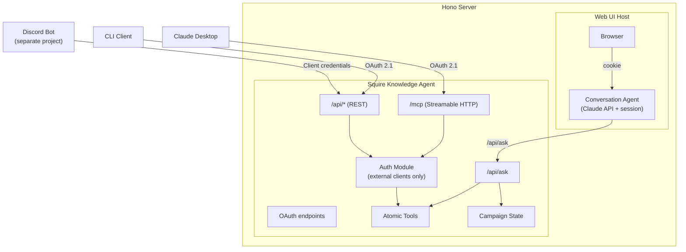
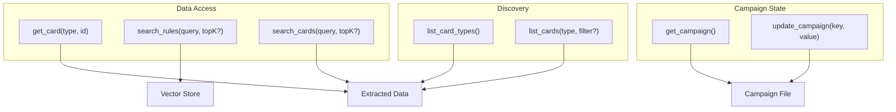

# Squire: Agent-Native Architecture Plan

## Context

Squire is a Frosthaven/Gloomhaven knowledge platform. It currently runs as a
CLI tool with a bundled RAG pipeline (`askFrosthaven()`). The goal is to evolve
it into an **agent-native knowledge platform** — a set of atomic tools that
agents compose to achieve outcomes, exposed via MCP, REST API, web UI, CLI,
and agent skill.

This follows [agent-native architecture principles][agent-native] by Dan
Shipper: features are outcomes described in prompts, pursued by agents with
tools in iterative loops. Squire provides the knowledge tools; agents provide
the reasoning.

[agent-native]: https://every.to/guides/agent-native

Discord integration will move to a separate project that consumes Squire's
tools.

## Design Principles

### Atomic tools, not bundled pipelines

The current `askFrosthaven()` bundles embedding, vector search, card search,
context assembly, and LLM generation into one function. This is the anti-pattern
of "agent executes your workflow." Instead, Squire exposes **atomic data access
primitives** that agents compose with judgment.

### Dynamic capability discovery

Agents shouldn't need hardcoded knowledge of what data Squire has. They
discover it at runtime via `list_card_types()` and `list_cards()`. New card
types added to the data → agents discover and use them automatically.

### Graduated optimization

The bundled RAG pipeline doesn't disappear — it becomes an **optimized path**
for simple Q&A. Atomic tools are the foundation; the pipeline is a convenience
shortcut for the common case.

### Accumulated context

Squire maintains state about campaigns and players. Three entities:

- **User** — a person with an account. Exists independently of any campaign.
  Can ask general rules questions without an active campaign.
- **Campaign** — a game campaign with shared state: prosperity, completed
  scenarios, unlocked items, party composition, active scenario.
- **Player** — joins a user to a campaign. Holds per-player state: character
  class, level, items, personal quest, gold, ability cards, perks.

Campaigns are multiplayer. When a player asks "what items should I bring?",
Squire needs the campaign (what's unlocked), the player (which character),
and the user (who's asking). A user without an active campaign can still ask
general rules questions — campaign context is optional.

Both the conversation agent and knowledge agent need access to
user/campaign/player state — the conversation agent to present a campaign
picker and identify the user, the knowledge agent to personalize answers.
Since both live in the same Hono server process, they share a data store
(file-based or SQLite). If they ever separate, this becomes a shared
database or API.

Anonymous access (no user identity) may be supported in the future for
read-only rules queries.

## Architecture

### Two-agent model

The system separates **conversation** from **knowledge**:

- **Conversation agent** (web UI) — manages chat session, handles follow-ups,
  compacts history, presents results. Thin. One per client session.
- **Knowledge agent** (Squire core) — understands questions, decides retrieval
  strategy, loads campaign context, generates answers. Stateless per request.
  Shared by all clients.

The conversation agent calls Squire's `/api/ask` endpoint, not MCP tools
directly. This keeps the conversation agent focused on session management
and UX, while the knowledge agent owns all domain reasoning — including
which tools to use, how to resolve references from conversation history,
and how to factor in campaign context.

MCP tools remain available for **external agents** (Claude Desktop, Claude
Code, custom agents) that want to compose tools directly with their own
reasoning.



### Client types and interfaces

| Client | Interface | Auth | Identity |
| ------------------- | ----------- | ------------ | --------------------------------- |
| Web UI | `/api/ask` | Session cookie | userId + campaignId from session |
| Claude Desktop | `/mcp` | OAuth 2.1 | userId from token, campaign TBD |
| Claude Code | `/mcp` | OAuth 2.1 | userId from token, campaign TBD |
| CLI | `/api/*` | OAuth 2.1 | userId from token, campaign TBD |
| Services | `/api/*` | Client credentials | Service identity from token |

**Web UI conversation agent:**

- Calls `/api/ask` with question, conversation history, and campaign ID
- Does **not** use MCP tools directly — delegates domain reasoning to
  the knowledge agent
- Owns session management: chat history, context compaction, streaming,
  presentation

**External MCP clients (Claude Desktop, Claude Code, custom agents):**

- Use Streamable HTTP transport over the network
- Access atomic tools directly — they bring their own reasoning
- OAuth 2.1 required (auth code + PKCE for interactive, client credentials
  for machine-to-machine)

**REST clients (CLI, Discord bot, services):**

- Use REST endpoints for search, card lookup, and `/api/ask`
- OAuth 2.1 required

### Atomic tools



### The ask endpoint (knowledge agent)

`POST /api/ask` is the knowledge agent's entry point. It receives:

```json
{
  "question": "What items should I bring to tonight's scenario?",
  "history": [
    { "role": "user", "content": "We're playing scenario 14 tonight" },
    { "role": "assistant", "content": "Scenario 14 is..." }
  ],
  "campaignId": "frosthaven-2024",
  "userId": "bcm"
}
```

`campaignId` and `userId` are optional. Without them, the knowledge agent
answers general rules questions using only the rulebook and card data.
With them, it personalizes answers — "what items should I bring?" depends
on which character *you* are playing in *this campaign*.

The knowledge agent:

1. **Resolves references** — "it" in "what items work well with it?" becomes
   "Blinkblade" using conversation history
2. **Decides retrieval strategy** — which atomic tools to call, in what order,
   how many results to fetch
3. **Loads context** (if campaign/user provided) — shared campaign state plus
   the player's character, items, and personal quest
4. **Generates a grounded answer** — from source material, personalized to
   this player's situation when campaign context is available

Today this is a fixed pipeline (search rules + search cards + one LLM call).
Over time it evolves into an agent loop that uses the atomic tools with
judgment — the graduated optimization principle.

### Why atomic tools matter

With `askFrosthaven()` alone, an agent can only ask a question and get an
answer. With atomic tools, an agent can:

- "Compare the stats of all flying monsters at level 3"
- "Find all items that grant advantage, cross-reference with Blinkblade abilities"
- "What scenarios chain from scenario 61, and what monsters appear in them?"
- "We're fighting Earth Demons tonight — what are they immune to, and which of
  our items counter that?"

These are **emergent capabilities** — we never built features for them, but
agents compose the tools to accomplish them.

### Web UI conversation agent

The conversation agent is a thin session manager. It does **not** reason
about which Squire tools to use — it delegates that to the knowledge agent
via `/api/ask`.

**The conversation agent owns:**

- Chat session state (history, user identity)
- Context compaction — summarizes older history when it grows too long,
  sends a bounded window to `/api/ask`
- Streaming — proxies the knowledge agent's response to the browser via SSE
- Presentation — Frosthaven-themed chat (dark palette, icy blues, medieval
  typography), inline citations, tool visibility
- Follow-up handling — detects clarification needs, manages multi-turn flow

**The conversation agent does NOT own:**

- Retrieval strategy (which tools to call, how many results)
- Reference resolution ("what items work with it?" → Blinkblade)
- Campaign context (loaded server-side by the knowledge agent)
- Domain reasoning of any kind

This keeps the conversation agent simple and focused. Domain intelligence
lives in the knowledge agent, which can evolve its retrieval strategy
independently of the UI.

### Auth model

The auth module lives in the Hono server. It handles token issuance,
validation, client registration, and the consent UI. It could be extracted
to a separate service later.

| Client              | Grant type         | Auth needed? | Identity propagation         |
| ------------------- | ------------------ | ------------ | ---------------------------- |
| Web UI (in-process) | None               | No           | Request context from session |
| Claude Desktop      | Auth code + PKCE   | Yes          | From OAuth token             |
| CLI                 | Auth code + PKCE   | Yes          | From OAuth token             |
| Services            | Client credentials | Yes          | From OAuth token             |

### OAuth endpoints (built into Hono server)

- `/.well-known/oauth-authorization-server` — metadata discovery
- `/.well-known/oauth-protected-resource` — resource metadata
- `/authorize` — consent page (minimal HTML, Frosthaven-themed)
- `/token` — token issuance
- `/register` — dynamic client registration

Implemented using `@modelcontextprotocol/sdk` auth handlers. PKCE required
for all interactive clients. Dynamic Client Registration supported so clients
auto-register without manual setup.

## Implementation Status

Work is tracked in the [Squire Service Architecture][project] GitHub project.

[project]: https://github.com/orgs/maz-org/projects/1

### Completed

- **Atomic Tool Layer** — `searchRules`, `searchCards`, `listCardTypes`,
  `listCards`, `getCard` in `src/tools.ts`. Service layer with `initialize`,
  `isReady`, `ask` in `src/service.ts`. CLI wrapper in `src/query.ts`.
- **HTTP/REST API** — Hono server in `src/server.ts` with health check, search
  endpoints, card discovery/lookup, and `/api/ask` convenience endpoint.
  Structured JSON errors via global `onError` and `notFound` handlers.
- **MCP Server** — 5 atomic tools registered as MCP tools in `src/mcp.ts`.
  Streamable HTTP transport mounted at `/mcp` (stateless, no auth).
  In-process transport via `createInProcessClient()` for the web UI.
  Verified with Claude Desktop via `mcp-remote` bridge.

### In Progress / Planned

- **Auth Module** (#55–#59) — OAuth 2.1 for external MCP/REST clients
- **Web UI** (#60–#65) — Hono JSX + HTMX conversation agent
- **CLI Client** (#66–#69) — `squire` command-line tool
- **Campaign State** (#70–#72) — persistent campaign context

## Key Decisions

- **Architecture:** Agent-native — tools as primitives, features as prompts,
  emergent capability ([inspiration][agent-native])
- **Two-agent model:** Conversation agent (UI) + knowledge agent (Squire core).
  Conversation agent calls `/api/ask`, not MCP tools — domain reasoning
  belongs in the knowledge agent. MCP tools are for external agents.
- **Tool design:** Atomic + discovery — agents compose tools; discover data
  at runtime
- **RAG pipeline:** Optimized convenience — graduated-to-code hot path, not
  the foundation
- **HTTP framework:** Hono — lightweight, web-standard Request/Response,
  TypeScript-first, built-in JSX
- **MCP transport:** Streamable HTTP for external agents; in-process available
  but web UI uses `/api/ask` instead
- **Auth:** OAuth 2.1 for external clients; no auth in-process; identity
  propagated via request context
- **Web UI rendering:** Hono JSX + HTMX — server-rendered, no build step, no
  client framework
- **Web UI architecture:** Conversation agent calls `/api/ask` — thin session
  manager, domain reasoning stays in the knowledge agent
- **Web UI styling:** Tailwind CSS — Frosthaven dark/icy theme
- **Campaign state:** File-based; three entities (user, campaign, player);
  campaign context optional for general queries; anonymous access possible
  in future
- **Deployment:** Clone, configure, run — no Docker/packaging yet
- **Discord:** Separate project — Squire stays focused as a knowledge platform
