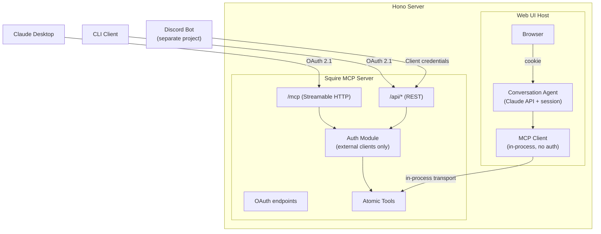
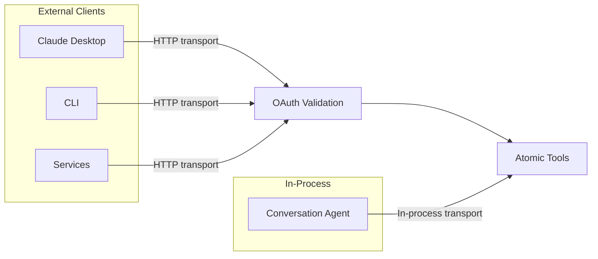
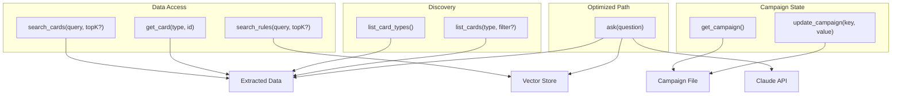

# Squire: Agent-Native Architecture Plan

## Context

Squire is a Frosthaven/Gloomhaven knowledge platform. It currently runs as a
CLI tool with a bundled RAG pipeline (`askFrosthaven()`). The goal is to evolve
it into an **agent-native knowledge platform** — a set of atomic tools that
agents compose to achieve outcomes, exposed via MCP, REST API, web UI, CLI,
and agent skill.

This follows [agent-native architecture principles][agent-native] by Dan
Shipper: features are outcomes described in prompts, pursued by agents with
tools in iterative loops. Squire provides the knowledge tools; agents provide
the reasoning.

[agent-native]: https://every.to/guides/agent-native

Discord integration will move to a separate project that consumes Squire's
tools.

## Design Principles

### Atomic tools, not bundled pipelines

The current `askFrosthaven()` bundles embedding, vector search, card search,
context assembly, and LLM generation into one function. This is the anti-pattern
of "agent executes your workflow." Instead, Squire exposes **atomic data access
primitives** that agents compose with judgment.

### Dynamic capability discovery

Agents shouldn't need hardcoded knowledge of what data Squire has. They
discover it at runtime via `list_card_types()` and `list_cards()`. New card
types added to the data → agents discover and use them automatically.

### Graduated optimization

The bundled RAG pipeline doesn't disappear — it becomes an **optimized path**
for simple Q&A. Atomic tools are the foundation; the pipeline is a convenience
shortcut for the common case.

### Accumulated context

Squire maintains state about the user's campaign (characters, completed
scenarios, prosperity level). Agents read this at session start for contextual
answers.

## Architecture

### Two-agent model

The system separates **conversation** from **knowledge**:

- **Conversation agent** (web UI) — manages chat session, handles follow-ups,
  remembers context, presents results. One per client.
- **Knowledge agent** (Squire core) — provides atomic data access tools,
  stateless, shared by all clients.

The conversation agent is an MCP client to Squire's MCP server. This means
the web UI consumes Squire the same way Claude Desktop or any other MCP client
does — dog-fooding the same tool interface.

### Transport and auth by client type

**In-process clients (web UI conversation agent):**

- Use in-process MCP transport (no HTTP round-trip)
- No OAuth — already inside the trust boundary
- Caller identity propagated via request context (user ID from session),
  so tools like campaign state know who's asking

**External network clients (Claude Desktop, CLI, Discord bot, services):**

- Use Streamable HTTP transport over the network
- OAuth 2.1 required (auth code + PKCE for interactive, client credentials
  for machine-to-machine)
- Auth module validates bearer tokens on every request

### Atomic tools

### Why atomic tools matter

With `askFrosthaven()` alone, an agent can only ask a question and get an
answer. With atomic tools, an agent can:

- "Compare the stats of all flying monsters at level 3"
- "Find all items that grant advantage, cross-reference with Blinkblade abilities"
- "What scenarios chain from scenario 61, and what monsters appear in them?"
- "We're fighting Earth Demons tonight — what are they immune to, and which of
  our items counter that?"

These are **emergent capabilities** — we never built features for them, but
agents compose the tools to accomplish them.

### Web UI as agent loop

The web UI is not a form that calls `POST /api/ask`. The conversation agent
connects to Squire via in-process MCP and converses with the user, making
multiple tool calls as needed. The chat session persists. The agent uses
campaign context for personalized answers.

This is where the Frosthaven-themed chat (dark palette, icy blues, medieval
typography) with HTMX streaming and inline citations lives. The agent behind
it does multi-step reasoning, not just single-shot Q&A.

Tool visibility: the UI shows which tools the agent is calling (search
progress, card lookups) — no silent actions.

### Auth model

The auth module lives in the Hono server. It handles token issuance,
validation, client registration, and the consent UI. It could be extracted
to a separate service later.

| Client              | Grant type         | Auth needed? | Identity propagation         |
| ------------------- | ------------------ | ------------ | ---------------------------- |
| Web UI (in-process) | None               | No           | Request context from session |
| Claude Desktop      | Auth code + PKCE   | Yes          | From OAuth token             |
| CLI                 | Auth code + PKCE   | Yes          | From OAuth token             |
| Services            | Client credentials | Yes          | From OAuth token             |

### OAuth endpoints (built into Hono server)

- `/.well-known/oauth-authorization-server` — metadata discovery
- `/.well-known/oauth-protected-resource` — resource metadata
- `/authorize` — consent page (minimal HTML, Frosthaven-themed)
- `/token` — token issuance
- `/register` — dynamic client registration

Implemented using `@modelcontextprotocol/sdk` auth handlers. PKCE required
for all interactive clients. Dynamic Client Registration supported so clients
auto-register without manual setup.

## Implementation Status

Work is tracked in the [Squire Service Architecture][project] GitHub project.

[project]: https://github.com/orgs/maz-org/projects/1

### Completed

- **Atomic Tool Layer** — `searchRules`, `searchCards`, `listCardTypes`,
  `listCards`, `getCard` in `src/tools.ts`. Service layer with `initialize`,
  `isReady`, `ask` in `src/service.ts`. CLI wrapper in `src/query.ts`.
- **HTTP/REST API** — Hono server in `src/server.ts` with health check, search
  endpoints, card discovery/lookup, and `/api/ask` convenience endpoint.
  Structured JSON errors via global `onError` and `notFound` handlers.
- **MCP Server** — 5 atomic tools registered as MCP tools in `src/mcp.ts`.
  Streamable HTTP transport mounted at `/mcp` (stateless, no auth).
  In-process transport via `createInProcessClient()` for the web UI.
  Verified with Claude Desktop via `mcp-remote` bridge.

### In Progress / Planned

- **Auth Module** (#55–#59) — OAuth 2.1 for external MCP/REST clients
- **Web UI** (#60–#65) — Hono JSX + HTMX conversation agent
- **CLI Client** (#66–#69) — `squire` command-line tool
- **Campaign State** (#70–#72) — persistent campaign context

## Key Decisions

- **Architecture:** Agent-native — tools as primitives, features as prompts,
  emergent capability ([inspiration][agent-native])
- **Two-agent model:** Conversation agent (UI) + knowledge agent (Squire core),
  connected via MCP
- **Tool design:** Atomic + discovery — agents compose tools; discover data
  at runtime
- **RAG pipeline:** Optimized convenience — graduated-to-code hot path, not
  the foundation
- **HTTP framework:** Hono — lightweight, web-standard Request/Response,
  TypeScript-first, built-in JSX
- **MCP transport:** Streamable HTTP for external clients; in-process for web
  UI conversation agent
- **Auth:** OAuth 2.1 for external clients; no auth in-process; identity
  propagated via request context
- **Web UI rendering:** Hono JSX + HTMX — server-rendered, no build step, no
  client framework
- **Web UI architecture:** Conversation agent as MCP client to Squire
  (dog-fooding)
- **Web UI styling:** Tailwind CSS — Frosthaven dark/icy theme
- **Campaign state:** File-based context — agents read/update; persists across
  sessions
- **Deployment:** Clone, configure, run — no Docker/packaging yet
- **Discord:** Separate project — Squire stays focused as a knowledge platform
